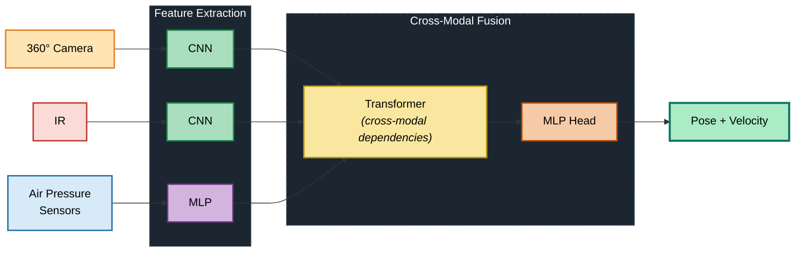

```mermaid
flowchart LR
    %% Inputs
    A1["360° Camera"]:::camIn
    A2["IR"]:::irIn
    A3["Air Pressure<br/>Sensors"]:::presIn

    %% Per-modality encoders (feature extraction)
    B1["CNN"]:::cnn
    B2["CNN"]:::cnn
    B3["MLP"]:::mlp

    %% Fusion
    C["Transformer<br/><i>(cross-modal dependencies)</i>"]:::xfmr

    %% Head
    D["MLP Head"]:::head

    %% Output
    E["Pose + Velocity"]:::out

    A1 --> B1
    A2 --> B2
    A3 --> B3

    B1 --> C
    B2 --> C
    B3 --> C

    C --> D --> E

    %% Grouping
    subgraph FE["Feature Extraction"]
        B1
        B2
        B3
    end

    subgraph FUSE["Cross-Modal Fusion"]
        C
        D
    end

    classDef camIn   fill:#FFE5B4,stroke:#E67E22,stroke-width:2px,color:#000
    classDef irIn    fill:#FADBD8,stroke:#C0392B,stroke-width:2px,color:#000
    classDef presIn  fill:#D6EAF8,stroke:#2874A6,stroke-width:2px,color:#000
    classDef cnn     fill:#A9DFBF,stroke:#1E8449,stroke-width:2px,color:#000
    classDef mlp     fill:#D2B4DE,stroke:#6C3483,stroke-width:2px,color:#000
    classDef xfmr    fill:#F9E79F,stroke:#B7950B,stroke-width:2px,color:#000
    classDef head    fill:#F5CBA7,stroke:#BA4A00,stroke-width:2px,color:#000
    classDef out     fill:#ABEBC6,stroke:#117A65,stroke-width:3px,color:#000

    style FE   fill:#1B2631,stroke:#85929E,stroke-dasharray: 5 5,color:#fff
    style FUSE fill:#1B2631,stroke:#85929E,stroke-dasharray: 5 5,color:#fff
```
